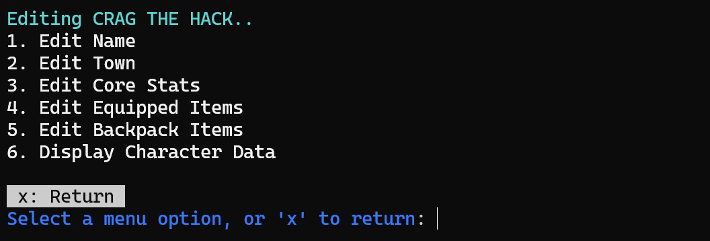

# ⚔️ Might & Magic - Book 1 Character Editor

This tool is designed to allow you to edit characters from the game _Might and Magic: Book One - The Secret of the Inner Sanctum (1986)_. It provides a simple interface for modifying save files, including character stats, equipped items, and backpack items.


# ✨ Features
- 🧾 **View character data.**
- 🛡️ **Modify character name and core stats such as intellect, might, speed etc.**
- 🎒 **Adjust equipped items and backpack contents.**
- 💾 **Save changes back to the game file.**

---


# <summary>⚙️ <strong>Installation</strong></summary>

### 🖥️ Compatibility

⚠️ **Note:** This program has only been tested on **Windows 11** so far. Compatibility with other operating systems is unverified.

### 🛠️ Prerequisites
- Ensure **Python 3.8 or higher** is installed on your system.  
  You can check your Python version by running:
  ```bash
  python --version
    ```
    
### 🔧 Steps to Install

1. **Clone the Repository**:
   Open a terminal or command prompt and clone the repository using the following command:
   ```bash
   git clone https://github.com/scrat321/MM1CharEdit.git
   ```

2. **Navigate to the Project Directory**:
   ```bash
   cd MM1CharEdit
   ```

3. **Create a Virtual Environment**:
    ```bash
    python -m venv venv & venv\Scripts\activate
    ```

4. **Install Required Dependencies**:
   ```bash
   pip install -r requirements.txt
   ```

### 🔍 Notes
- Always activate the virtual environment before running the project to ensure the correct dependencies are used.
- If you encounter issues during installation, ensure your Python and pip versions are up-to-date:
  ```bash
  python -m pip install --upgrade pip
  ```

# <summary>🚀 <strong>Usage</strong></summary>

### ▶️ Running the Editor
Run the following command in your terminal:
```bash
python charedit.py
```

Follow the on-screen instructions to view or edit character data.

### 🧭 Navigation
- Use the menu options displayed at the bottom of the screen to navigate.
- Input the corresponding key (e.g., `1`, `2`, `x`) to select options or exit.

### ⚙️ Example Configuration
The `config.json` file stores the path to the save game file:
```json
{
    "save_game_file_path": "path/to/your/savefile.sav"
}
```

# 📸 Screenshots
<br />
<br />
<br />
<br />
<br />
<br />


## 🔗 Useful Links

- [https://www.oldgames.sk](https://www.oldgames.sk/docs/Might-and-Magic/1/index.html) -  


# ⚠️ Disclaimer
This tool is provided as-is. Modifying game files carries risks, so make a backup of your save files before using this editor.


# 📜 License
 ```plaintext
 MIT License

 Copyright (c) 2024 Anthony Simone

 Permission is hereby granted, free of charge, to any person obtaining a copy
 of this software and associated documentation files (the "Software"), to deal
 in the Software without restriction, including without limitation the rights
 to use, copy, modify, merge, publish, distribute, sublicense, and/or sell
 copies of the Software, and to permit persons to whom the Software is
 furnished to do so, subject to the following conditions:

 The above copyright notice and this permission notice shall be included in all
 copies or substantial portions of the Software.

 THE SOFTWARE IS PROVIDED "AS IS", WITHOUT WARRANTY OF ANY KIND, EXPRESS OR
 IMPLIED, INCLUDING BUT NOT LIMITED TO THE WARRANTIES OF MERCHANTABILITY,
 FITNESS FOR A PARTICULAR PURPOSE AND NONINFRINGEMENT. IN NO EVENT SHALL THE
 AUTHORS OR COPYRIGHT HOLDERS BE LIABLE FOR ANY CLAIM, DAMAGES OR OTHER
 LIABILITY, WHETHER IN AN ACTION OF CONTRACT, TORT OR OTHERWISE, ARISING FROM,
 OUT OF OR IN CONNECTION WITH THE SOFTWARE OR THE USE OR OTHER DEALINGS IN THE
 SOFTWARE.
 ```
